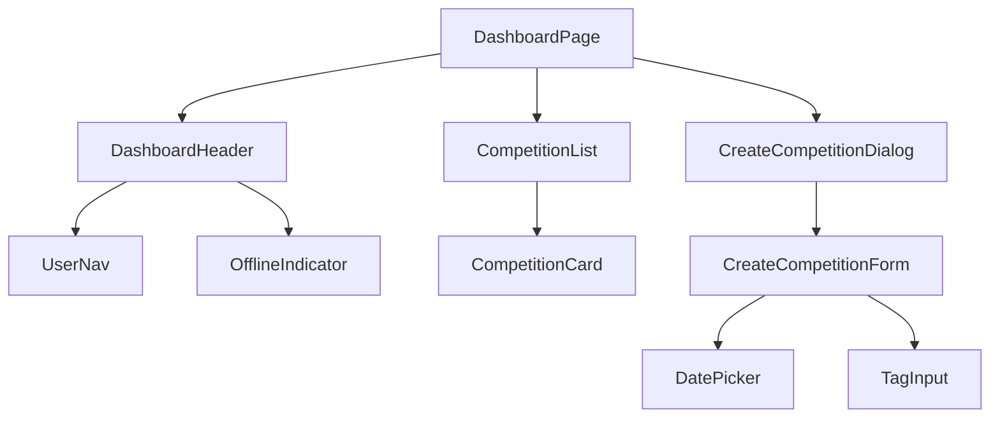

# Plan implementacji widoku Dashboard

## 1. Przegląd
Widok Dashboardu (`/dashboard`) jest głównym centrum dowodzenia dla Organizatora zawodów. Pełni dwie kluczowe funkcje:
1.  **Lista zawodów**: Wyświetla wszystkie zawody (Planowane, W toku, Zakończone) z szybkim podglądem ich statusu.
2.  **Kreator zawodów**: Umożliwia zdefiniowanie nowych zawodów (Data, Stanowiska, Kategorie).

Widok musi działać w trybie **Offline-first**, wyświetlając dane z pamięci podręcznej w przypadku braku połączenia oraz synchronizować statusy po odzyskaniu sieci.

## 2. Routing widoku
*   **Ścieżka:** `/dashboard`
*   **Wymagany Auth:** Tak (wymaga zalogowanego użytkownika - `Authenticated Route`). w przypadku braku sesji przekierowanie na `/auth/login`.

## 3. Struktura komponentów


## 4. Szczegóły komponentów

### DashboardPage
- **Opis:** Główny kontener strony. Zarządza układem (layoutem) oraz stanem widoczności modala kreatora.
- **Główne elementy:** `div` (container), `DashboardHeader`, `CompetitionList`, `Fab` (Floating Action Button - na mobile) lub `Button` (na desktopie).
- **Obsługiwane zdarzenia:**
    - `onCreateClick`: Otwiera `CreateCompetitionDialog`.

### CompetitionList
- **Opis:** Lista kafelkowa wyświetlająca zawody. Obsługuje stany ładowania (Skeletons) i pusty stan (EmptyState).
- **Główne elementy:** `div` (container grid/flex), mapowanie po tablicy zawodów.
- **Propsy:**
    - `competitions`: `CompetitionDTO[]`
    - `isLoading`: `boolean`

### CompetitionCard
- **Opis:** Karta pojedynczych zawodów. Cała karta jest linkiem nawigacyjnym.
- **Główne elementy:** `Card`, `CardHeader` (Nazwa, Badge statusu), `CardContent` (Data, Liczba stanowisk, Ilość uczestników).
- **Logika nawigacji:**
    - Status `PLANNED` -> `/competitions/[id]/participants`
    - Status `IN_PROGRESS` -> `/competitions/[id]/weighing`
    - Status `FINISHED` -> `/competitions/[id]/results`
- **Propsy:**
    - `competition`: `CompetitionDTO`

### CreateCompetitionDialog
- **Opis:** Dialog (na desktop) lub Drawer (na mobile) zawierający formularz tworzenia.
- **Główne elementy:** `Dialog` / `Drawer` (shadcn/ui).
- **Obsługiwane zdarzenia:**
    - `open`: boolean
    - `onOpenChange`: (open: boolean) => void

### CreateCompetitionForm
- **Opis:** Formularz oparty na RHF i Zod.
- **Pola formularza:**
    - `name`: Text Input (min. 3 znaki).
    - `date`: DatePicker (wymagana data przyszła lub dzisiejsza).
    - `pegs_count`: Number Input (min. 1).
    - `categories`: TagInput (tablica stringów, np. ["Senior", "Junior"]).
- **Obsługiwana walidacja:** Zod Schema (`CreateCompetitionSchema`). Walidacja `mode: 'onBlur'`. Przycisk submit zablokowany podczas `isSubmitting`.
- **Integracja API:** Wywołuje mutację `useCreateCompetition` oraz następnie dla każdej kategorii `useCreateCategory`.

### TagInput (Component)
- **Opis:** Komponent do wprowadzania kategorii.
- **Działanie:** Wpisanie tekstu + Enter tworzy "kafelek" (badge) z możliwością usunięcia (X).
- **Propsy:**
    - `value`: string[]
    - `onChange`: (tags: string[]) => void

## 5. Typy

### Modele Danych (DTO)
```typescript
// Bazuje na src/types/database.types.ts
import { CompetitionStatus } from '@/types/database.types';

export interface CompetitionDTO {
  id: string;
  name: string;
  date: string; // ISO String
  pegs_count: number;
  status: CompetitionStatus;
  participants_count?: number; // Opcjonalnie, jeśli API to zwraca (join)
}
```

### Formularze
```typescript
export interface CreateCompetitionFormValues {
  name: string;
  date: Date;
  pegs_count: number;
  categories: string[]; // Nazwy kategorii do utworzenia
}
```

## 6. Zarządzanie stanem

### React Query (Server State)
- **`useCompetitions`**: Hook `useQuery`.
    - Key: `['competitions']`
    - Fetcher: `GET /api/competitions` (z opcją sortowania po dacie malejąco).
    - Config: `staleTime: 5 min` (dane nie zmieniają się często).
- **`useCreateCompetition`**: Hook `useMutation`.
    - MutationFn: `POST /api/competitions`.
    - OnSuccess: Inwalidacja `['competitions']`.

### Local State (Client State)
- **`isCreateDialogOpen`**: `boolean` (useState w `DashboardPage`).
- **`isOffline`**: `boolean` (z custom hooka `useNetworkStatus`).

## 7. Integracja API

### Endpointy
1.  **Pobranie listy:**
    - `GET /api/competitions`
    - Response: `CompetitionDTO[]`
2.  **Utworzenie zawodów:**
    - `POST /api/competitions`
    - Payload: `{ name: string, date: string, pegs_count: number }`
    - Response: `CompetitionDTO`
3.  **Utworzenie kategorii (Krok 2):**
    - `POST /api/competitions/[id]/categories`
    - Payload: `{ name: string }`
    - Wykonywane w pętli `Promise.all` po sukcesie utworzenia zawodów.

## 8. Interakcje użytkownika
1.  **Wejście na dashboard:** Ładowanie listy (Spinner). Wyświetlenie listy kart.
2.  **Kliknięcie "Utwórz":** Otwarcie Modala. Focus na polu "Nazwa".
3.  **Wypełnianie formularza:**
    - Data: Wybór z kalendarza.
    - Kategorie: Wpisanie "Senior" [Enter], "Junior" [Enter].
4.  **Zatwierdzenie:** Kliknięcie "Utwórz". Przycisk wchodzi w stan `loading`.
5.  **Sukces:** Modal zamyka się. Toast "Zawody utworzone pomyślnie". Nowe zawody pojawiają się na liście.
6.  **Kliknięcie w zawody:** Przekierowanie do odpowiedniego widoku szczegółowego.

## 9. Warunki i walidacja

### Walidacja Formularza (Zod)
- **Nazwa:** `required`, `min(3)`.
- **Data:** `required`, musi być poprawnym obiektem daty.
- **Liczba stanowisk:** `required`, `int`, `positive`, `min(1)`.
- **Kategorie:** Opcjonalne (pusta lista = Open). Unikalność nazw w liście (walidacja frontendowa `refine`).

### Warunki UI
- Jeśli `status === 'FINISHED'`, karta powinna być wizualnie "wygaszona" (np. opacity-75 lub szare tło).
- Jeśli `isOffline === true`, przycisk "Utwórz" powinien wyświetlać ostrzeżenie lub być zablokowany (chyba że zaimplementujemy kolejkę offline dla tworzenia, w MVP zalecane zablokowanie tworzenia root entities offline dla uproszczenia ID).

## 10. Obsługa błędów
- **Błąd pobierania listy:** Wyświetlenie komponentu `ErrorState` z przyciskiem "Spróbuj ponownie".
- **Błąd tworzenia zawodów:** Toast `error` ("Nie udało się utworzyć zawodów"). Formularz pozostaje otwarty.
- **Błąd tworzenia kategorii (częściowy sukces):** Toast `warning` ("Zawody utworzone, ale wystąpił błąd przy dodawaniu kategorii. Dodaj je ręcznie w ustawieniach.").

## 11. Kroki implementacji
1.  **Setup Typów i Schematów:** Stworzenie `src/features/dashboard/schema.ts` (Zod) i typów.
2.  **API Client:** Dodanie funkcji `getCompetitions` i `createCompetition` w `src/lib/api/competitions.ts`.
3.  **Komponent Karty:** Implementacja `CompetitionCard.tsx` z wariantami statusów (Badge).
4.  **Lista:** Implementacja `CompetitionList.tsx` (Grid layout + loading state).
5.  **Dashboard Page:** Złożenie nagłówka i listy w `app/dashboard/page.tsx`.
6.  **Formularz Kreatora:** Implementacja `CreateCompetitionForm.tsx` z obsługą `TagInput`.
7.  **Integracja:** Podpięcie `useMutation` w formularzu i obsługa logiki "Saga" (Najpierw zawody -> Potem kategorie).
8.  **Weryfikacja:** Testy manualne tworzenia i nawigacji.
